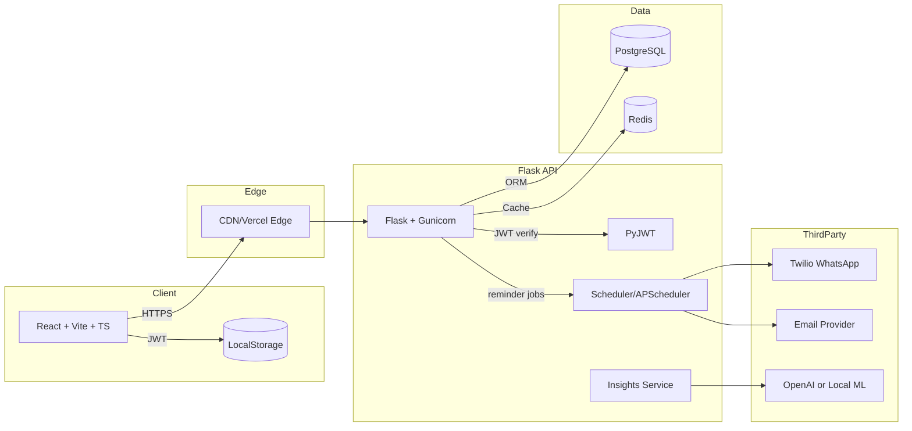

# FinMind — AI-Powered Budget & Bill Tracking

FinMind helps users control spending, track bills, and get smart financial insights. Built for free-tier friendly deployment with scalable architecture.

## System Architecture



## PostgreSQL Schema (DDL)
See `backend/app/db/schema.sql`. Key tables:
- users, categories, expenses, bills, reminders
- ad_impressions, subscription_plans, user_subscriptions
- refresh_tokens (optional if rotating), audit_logs

## Redis Caching Policy
- Keys
  - `user:{id}:monthly_summary:{yyyy-mm}` — 30 min TTL
  - `user:{id}:categories` — 24h TTL
  - `user:{id}:upcoming_bills` — 15 min TTL
  - `insights:{id}` — 24h TTL (invalidate on new expense/bill)
- Invalidation
  - On expense/bill create/update/delete -> delete affected monthly_summary, upcoming_bills, insights
- Rate limiting (optional): `rl:{userId}:{endpoint}:{minute}` with short TTL

## API Endpoints
OpenAPI: `backend/app/openapi.yaml`
- Auth: `/auth/register`, `/auth/login`, `/auth/refresh`
- Expenses: CRUD `/expenses`
- Bills: CRUD `/bills`, pay/mark `/bills/{id}/pay`
- Reminders: CRUD `/reminders`, trigger `/reminders/run`
- Insights: `/insights/monthly`, `/insights/budget-suggestion`

## MVP UI/UX Plan
- Auth screens: register/login.
- Dashboard:
  - Monthly spend chart, category breakdown donut.
  - Upcoming bills list with due dates and pay status.
  - AI budget suggestion card.
- Expenses page: add expense (amount, category, notes, date), list & filter.
- Bills page: create bill (name, amount, cadence, due date, channel), toggle WhatsApp/email.
- Settings: profile, categories, reminders default channel, export (premium).

## Monetization Plan
- Free: ads in dashboard and list pages (lightweight, non-intrusive). Record impressions in `ad_impressions`.
- Premium ($/mo): CSV/Excel export, multi-device sync, priority insights, remove ads.
- Payments stubbed; swap in Stripe when moving off free tier.

## Organic Marketing Strategies
- Content: budgeting tips, “FinMind monthly challenge” on socials.
- SEO: landing with calculators (50/30/20, debt snowball), schema markup.
- Communities: Reddit PF, indie hackers build-in-public.
- Referral: give 1 month premium for inviting 3 friends.

## Project Structure
```
finmind/
  backend/
    app/
      __init__.py
      config.py
      extensions.py
      models.py
      routes/
        __init__.py
        auth.py
        expenses.py
        bills.py
        reminders.py
        insights.py
      services/
        __init__.py
        ai.py
        cache.py
        reminders.py
      db/
        schema.sql
      openapi.yaml
    wsgi.py
    requirements.txt
    Dockerfile
  frontend/
    index.html
    src/
      main.tsx
      App.tsx
      components/
        AdBanner.tsx
        Charts.tsx
      pages/
        Dashboard.tsx
        Expenses.tsx
        Bills.tsx
        Settings.tsx
    package.json
    tsconfig.json
    vite.config.ts
    Dockerfile
  .github/
    workflows/
      ci.yml
  docker-compose.yml
  .env.example
```

## Deployment
- Backend: Dockerized Flask to Railway/Render free tier (Postgres & Redis managed or via Compose locally).
- Frontend: Vercel.
- Secrets: use environment variables (.env locally, platform secrets in cloud).

## Local Development
1) Prereqs: Docker, Docker Compose, Node 20+, Python 3.11+
2) Copy env: `cp .env.example .env` and fill secrets
3) Start: `docker compose up --build`
4) Frontend at http://localhost:5173, Backend at http://localhost:8000

### Backend Test Runner (No local pytest setup required)
- PowerShell (Windows):
  - `./scripts/test-backend.ps1`
  - single file: `./scripts/test-backend.ps1 tests/test_dashboard.py`
- POSIX shell:
  - `sh ./scripts/test-backend.sh`
  - single file: `sh ./scripts/test-backend.sh tests/test_dashboard.py`

## Testing & CI
- Backend: pytest, flake8, black. Frontend: vitest, eslint.
- GitHub Actions `ci.yml` runs lint, tests, and builds both apps; optional docker build.

## Notes on Free-Tier Reminders
- Primary: schedule via APScheduler in-process with persistence in Postgres (job table) and a simple daily trigger. Alternatively, use Railway/Render cron to hit `/reminders/run`.
- Twilio WhatsApp free trial supports sandbox; email via SMTP (e.g., SendGrid free tier).

## Security & Scalability
- JWT access/refresh, secure cookies OR Authorization header.
- RBAC-ready via roles on `users.role`.
- N+1 avoided via SQLAlchemy eager loading.
- Redis caching for hot paths to cut DB load.
- 12-factor app env config; stateless API.

---

MIT Licensed. Built with ❤️.
